# CDM and Azure Data Services Integration

Tutorial and sample code for integrating Power BI Dataflows and Azure Data Services using CDM folders in Azure Data Lake Storage Gen 2.

## 1 Introduction
Business analysts who use Power BI dataflows can now share data with data engineers and data scientists, who can leverage the power of Azure Data Services, including Azure Databricks, Azure Machine Learning, Azure SQL Data Warehouse and Azure Data Factory, for advanced analytics and AI. 
This tutorial walks through use of Common Data Model (CDM) metadata and CDM folders in a modern data warehouse scenario using Azure Data Services.  For more information on the scenario, see this blog post. 
The tutorial walks through the flows highlighted in green in the diagram below.  Each flow leverages the metadata contained in a CDM folder to make it easier and simpler to accomplish the task. You will:

0.	[Configure Power BI to save Power BI Dataflows as CDM folders in Azure Data Lake Storage Gen2](#34-create-an-adls-gen2-account-and-configure-power-bi-connectivity)
1.	[Create a Power BI dataflow by ingesting sales data from the Wide World Importers sample database and save it as a CDM folder](#41-create-a-power-bi-dataflow-from-the-wide-world-importersd-database)
2.	[Use an Azure Databricks notebook to prepare and cleanse the data in the CDM folder, and then write the updated data to a new CDM folder in the data lake](#42-use-azure-databricks-to-prepare-the-data-in-a-new-cdm-folder)
3.	[Use Azure Machine Learning to train and publish a model using data from the CDM folder](#43-use-machine-learning-to-train-a-machine-learning-model)
4.	[Use Azure SQL Data Warehouse to create a data warehouse](#44-use-azure-sql-data-warehouse-to-create-a-data-mart-for-the-sales-data)
5.	[Use Azure Data Factory to orchestrate Databricks data preparation and then load into SQL Data Warehouse](#45-use-azure-data-factory-to-orchestrate-databricks-data-preparation-and-then-loading-the-prepared-data-into-sql-data-warehouse)
6.	[Deploy the dimensional schema to the DW and transform the staged data](#46-deploy-the-dimensional-schema-to-the-dw-and-transform-the-staged-data)

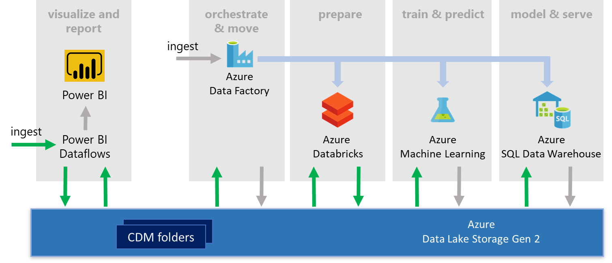

The tutorial uses sample libraries, code, and Azure resource templates that you can use with CDM folders that you create from your own data. The core CDM folder libraries for reading and writing model.json files can also be found in the [CDM GitHub repository](https://aka.ms/cdmrepo) along with sample schemas. 

>IMPORTANT: the sample code is provided as-is with no warranties and is intended for learning purposes only.  You should not use the sample code in production applications.

## 2 Prerequisites

Before you get started you need the following:

- An Azure subscription.  Get a free trial:  https://azure.microsoft.com   
> IMPORTANT: To use the Azure Databricks sample, you will need to convert the free account to a pay-as-you-go subscription. If you have a free trial you can use for the other Azure services in the tutorial but you will have to skip the Azure Databricks section.  
- A Power BI Pro account.  Get a free trial: https://powerbi.microsoft.com 

You should also download and install the following tools which will help you inspect and use resources created in the tutorial.
- [Azure Storage Explorer](https://azure.microsoft.com/features/storage-explorer/). v1.6 or above supports Azure Data Lake Storage Gen 2.  
- [SQL Server Management Studio (SSMS)](https://docs.microsoft.com/sql/ssms/sql-server-management-studio-ssms?view=sql-server-2017) or [Azure Data Studio](https://docs.microsoft.com/sql/azure-data-studio/) or your preferred SQL development tool.   

## 3 Getting Started
In this section you deploy and configure resources needed for the tutorial.  Tasks include:
- Download the GitHub repo
- Create an Azure resource group 
- Create an Azure Storage account for uploading files used in the tutorial
- Create an Azure Data Lake Storage Gen 2 account in which Power BI dataflows will be saved as CDM folders.
- Deploy the Wide World Importers database to Azure SQL Database.

### 3.1	Download the GitHub repo
The tutorial uses files stored in https://github.com/Azure-Samples/cdm-azure-data-services-integration 

Clone or download the repo to your local machine so you have access to these files.  

### 3.2	Create an Azure resource group
It’s recommended that you create a new Azure resource group and use it for all Azure resources created in the tutorial.  When you finish the tutorial, delete this resource group to delete all resources.  

> Note: create Azure resources in the same location as your Power BI tenant.  See, [Where is my Power BI tenant located?](https://docs.microsoft.com/power-bi/service-admin-where-is-my-tenant-located)

### 3.3	Create a standard storage account and container for uploading files
For uploading files used in the tutorial, create a standard (not premium) storage account. This must be a regular storage account, separate from the ADLS Gen2 account.  Do not enable the hierarchical name space on this account. Once created, add a Blob container into which you will upload files.

### 3.4	Create an ADLS Gen2 account and configure Power BI connectivity 
Create and configure an ADLS Gen2 storage account with a filesystem endpoint to allow Power BI to connect to it and configure your Power BI account to allow workspaces to save dataflows to this ADLS Gen2 endpoint.
1.	See, [Power BI Administrator guide to set up and connect ADLSg2 account to Power BI](https://go.microsoft.com/fwlink/?linkid=2048102)

>IMPORTANT: the ADLS Gen2 account you associate with your Power BI account cannot be changed later so consider this step carefully if you are doing this with an important Power BI account.

Once your ADLS Gen2 account and Power BI are configured correctly, you must create a Power BI workspace that is configured to save dataflows to the designated ADLS Gen 2 account. This is the workspace in which you will create the dataflow used in this tutorial. 

2.	See, [Guide to configuring a workspace to store its dataflows in the organization’s lake](https://go.microsoft.com/fwlink/?linkid=2048100)  

### 3.5	Create the Wide World Importers database
The tutorial uses data from the Wide World Importers sample database.  You extract sales data from this database using a Power BI dataflow later in the tutorial.
1.	**Upload the Wide World Importers - Standard bacpac file**
    
    Using Azure Storage Explorer or the Azure portal, upload the **WideWorldImporters-Standard.bacpac** file (as BlockBlob if prompted) to the standard Blob storage container created earlier.  The bacpac file is in the …/AzureSqlDatabase/ folder in the downloaded repo.

2.	**Create a logical server**

    To create a database from a bacpac file, you must first create the logical SQL server that will hold the database.  Later you also create a SQL Data Warehouse on this server.  It is recommended you create a new server for the tutorial.  

    a. To create an Azure SQL Database server (without a database) using the Azure portal, navigate to a [blank SQL server (logical server)](https://portal.azure.com/#create/Microsoft.SQLServer) form

    b.	Create a server in the same resource group and location as the storage accounts created earlier. 

3.	**Create the database by importing the bacpac file**
    
    Got to the server page in the Azure portal, 

    a. Click on **Import database** 

    b.	Click on **Storage** and navigate to the **WideWorldImporters-Standard.bacpac** file  

    c.	Change the **Pricing Tier** to **50 DTUs** using the DTUs slider to reduce import time.  

    d.	Enter your server admin password and click **OK**.

    > NOTE: When you import a bacpac, a job is submitted to an import service queue.  The job may not run immediately, especially if it is submitted at a busy time.  This step can take several minutes.  

4.	**Create a firewall rule on the server**

    To access a SQL Database from outside Azure, for example, from SSMS or Power BI desktop, add a firewall rule to the server to grant access to your client IP address or to a range of IPs.

    a.	On the server page in the Azure portal, use **Firewalls and Virtual Networks**

    b.	Select **+ Add client IP**, then **Save**

5.	**Inspect the database (optional)**

    Once imported, connect to the database with SSMS and browse the tables.  Later, when you create the Power BI dataflow, you will pick from these tables to create corresponding entities.

    

At this point the Wide World Importers database is deployed and ready for use as a data source.

## 4.0 Main tutorial

Once you’ve completed the getting started tasks, you’re ready to run the main tutorial, in which you:
- **Connect to an operational database and extract sales data into a CDM folder** in ADLS gen 2 using a Power BI dataflow. 
- **Prepare the data for analytics processing** using Azure Databricks. The prepared data is written to a new CDM folder 
- **Train and publish a machine learning model** with using Azure Machine Learning 
 - **Load the data into an Azure SQL Data Warehouse** using an Azure Data Factory pipeline 
- **Orchestrate all the Azure tasks** above using another Azure Data Factory pipeline

Running through the tasks above will take some time, so grab a coffee and buckle-up!

### 4.1	Create a Power BI dataflow from the Wide World Importers database

With this task you create a Power BI dataflow to ingest sales data from the Wide World Importers database and save the dataflow definition and extracted data as a CDM folder in ADLS Gen 2.   
1.	Login to [Power BI online](https://powerbi.microsoft.com/)
2.	Open the workspace that you previously created and enabled to save dataflows to ADLS Gen 2
3.	Select **+ Create** and then **Dataflow **

    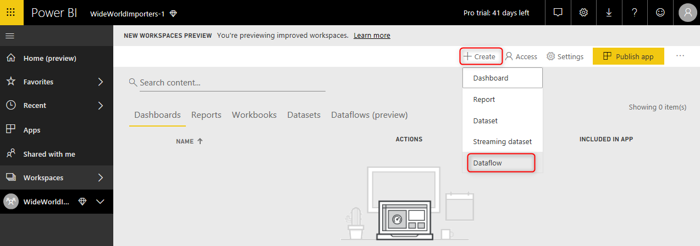

4.	Select **Add new entities**
5.	Choose the data source.  To filter the list, click **Azure**.  Then select **Azure SQL Database**

    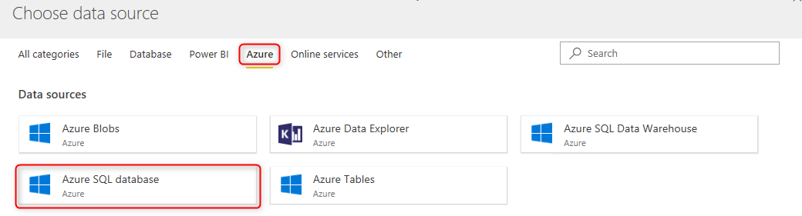
 
6.	Enter the **Server** name (<server>.database.windows.net) and the **Database** name (WideWorldImporters-Standard), and enter the server admin credentials you provided earlier. 
7.	Select the tables to be extracted:  
    a.	Enter **“Sales”** in the search bar to filter the list to the tables in the Sales schema.  
    b.	Select **Sales.BuyingGroups, Sales.CustomerCategories, Sales.Customers, Sales.OrderLines, Sales.Orders**  

     

8.	Enter **“Warehouse”** in the search bar to filter the list to the tables in the Warehouse schema  
    a.	Select **Warehouse.Colors, Warehouse.PackageTypes, Warehouse.StockItems** 
9.	**Clear the search bar** and check that 8 tables area selected.  Do not include any _Archive tables 
10.	Click **Next** and then on the Edit queries screen, select **Done** to create the dataflow

    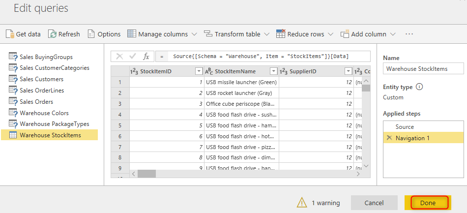

11.	Review the entities selected for the dataflow and click **Save**. When prompted, name the dataflow **WideWorldImporters-Sales**.   

    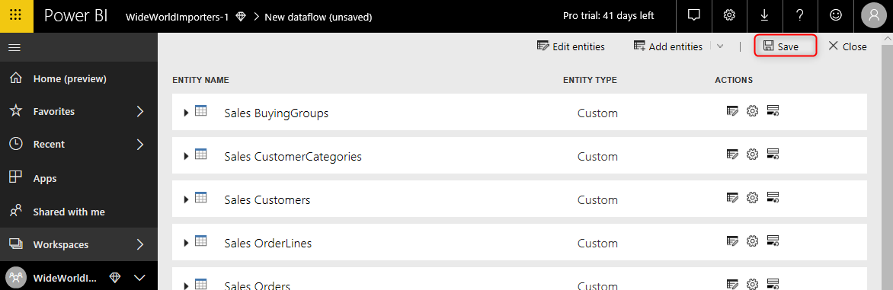

12.	When the dataflow definition has saved, refresh to extract and save the data. Either choose **Refresh now** in the notification pop up, or go to the list of dataflows in the current workspace and click the refresh icon on the new dataflow to trigger refresh.

    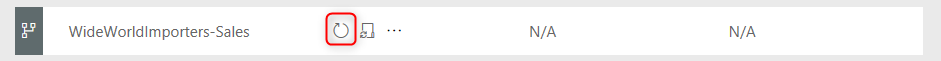
  
13.	The dataflow will load data from the selected tables and refresh the CDM folder.  The dataflow entry is updated to show the refresh time.
 
14.	Click on the ellipsis on the dataflow, and then **Settings**

    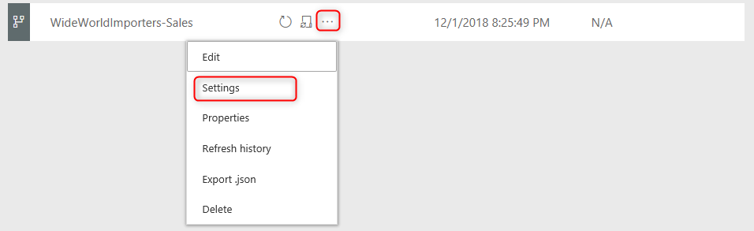
 
15.	Review the location of the CDM folder in ADLS Gen 2

    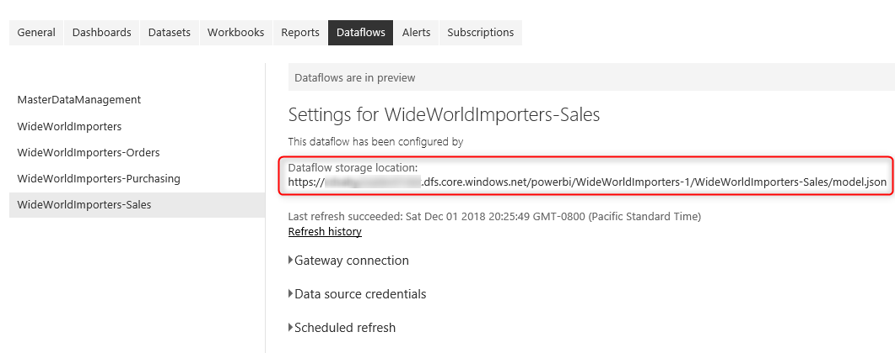
 
16.	Use the Azure Storage Explorer to browse to the CDM folder and review its structure. 

    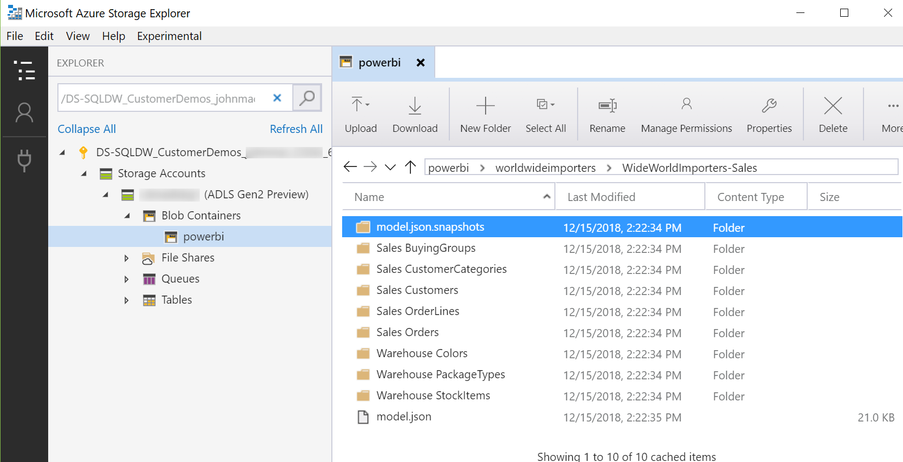
 
17.	Note the model.json in the root folder and the entity folders, created one per entity, which contain subfolders that contain data files formatted as CSV. 

At this point you have successfully used Power BI dataflows to extract data from a database and saved it in a CDM folder in ADLS Gen2.  This data can be accessed from any ADLS Gen2 aware service in Azure. 

### 4.2	Use Azure Databricks to prepare the data in a new CDM folder

In this section, you use an Azure Databricks notebook to process the data in the extracted CDM folder to prepare it for training a machine learning model and loading into a data warehouse.  The modified data is written to a new CDM folder in ADLS Gen2.

>IMPORTANT: Before you can use Azure Databricks clusters, if you are using a free trial Azure subscription you must upgrade it to pay-as-you-go. If you don’t wish to upgrade, skip this section of the tutorial. 

#### 4.2.1	Deploy Azure Databricks resources 

1.	Create an Azure Databricks service and workspace in the same location as the ADLS Gen2 account using either the [portal](https://docs.microsoft.com/azure/azure-databricks/quickstart-create-databricks-workspace-portal) or the Azure Resource Manager [template](https://docs.microsoft.com/azure/azure-databricks/quickstart-create-databricks-workspace-resource-manager-template). The pricing tier that you pick for the workspace can be Standard, Premium or Trial. If you pick Trial, you will not be charged for DBUs for 14 days after which you will need to convert the workspace to Standard or Premium to continue using Azure Databricks. Refer [here(https://azure.microsoft.com/pricing/details/databricks/)] for pricing details.  
2.	In the Azure portal, on the Databricks service Overview page, click **Launch Workspace** button  
3.	[Create](https://docs.azuredatabricks.net/user-guide/clusters/create.html) a cluster within the workspace that you just launched.  
    > IMPORTANT: Create a cluster with the Databricks Runtime Version value to be 4.3 with Apache Spark 2.3.1  
4.	[Install](https://docs.databricks.com/user-guide/libraries.html#create-a-workspace-library) the Scala library package which helps read and write CDM folders on the cluster that you created. This helper library, built from of the CDM folder python library, brings the power of CDM Folders to Azure Databricks and is used in the sample to read and write CDM folders just like other native Spark data sources. It allows access not only to the data but also the schema metadata that can be used to validate the raw data read from file. The library to install is in the tutorial repo at https://github.com/Azure-Samples/cdm-azure-data-services-integration/tree/master/AzureDatabricks/Library and is called **spark-cdm_2.11-0.2.jar**

    > IMPORTANT: Restart the cluster after you have created and attached the library.

#### 4.2.2	Use a Databricks notebook to prepare the data
1.	Import the **read-write-demo-wide-world-importers.py** notebook from the [tutorial repo](https://github.com/Azure-Samples/cdm-azure-data-services-integration/tree/master/AzureDatabricks/Samples) to your workspace folder. The folder location will be Workspace -> Users ->  *your username*.  
    This notebook does three data preparation steps on the original data and writes the transformed Wide World Importers data to a new CDM folder that can be used as an input by other Azure services
2.	Setup the **service principal authentication type** with ADLS Gen2 (note: storage key is not supported as this time). Azure Databricks will use this authentication mechanism to read and write CDM folders from ADLS Gen2. To use service principal authentication, follow these steps:  
    - Register an application entity in Azure Active Directory (Azure AD) (details [here](https://docs.microsoft.com/azure/storage/common/storage-auth-aad-app)). This can be an existing web app/api application or you can [create a new one](https://docs.microsoft.com/azure/active-directory/develop/howto-create-service-principal-portal). 
    - Make a note of the application name which you will use when granting permissions to the ADLS Gen2 account.
    - Make note of the following values, which you use to run the notebook sample:  

        - **Application ID**  
        - **Application ke**y (also referred to as **client secret** or **application password**)  
        - [**Tenant ID**](https://docs.microsoft.com/azure/storage/common/storage-auth-aad-app#get-the-tenant-id-for-your-azure-active-directory)
    - Grant the service principal proper permission in Azure storage, which can be done in the Access control (IAM) section.
        - Grant the **Storage Blob Data Contributor** role on the ADLSgen2 account to the application ID you just created.
3.	To avoid the Application ID, Application Key and Tenant ID values from showing up in code, you should use Azure Databricks Secrets. Use [these](https://docs.azuredatabricks.net/user-guide/secrets/index.html#secrets-user-guide) instructions to create a secret scope and secrets for the above values. You can also just paste your credentials into the notebook, but that is not recommended.
4.	Assign appropriate values to the following variables in the notebook. Values to be replaced are also indicated in the notebook in angle brackets <>

    |Variable| Value to be assigned|
    |--------|---------------------|
    |inputLocation| Location of the model.json in the input CDM folder. If you are using this notebook as part of an ADF pipeline, populate this from ADF. The values to be replaced in the notebook are **\<adlsgen2accountname\>** and **\<workspacename>**|
    |outputLocation	| Location of the output CDM folder. This will be created if it does not exist.  If you are using this notebook as part of an ADF pipeline, populate this from ADF.   The values to be replaced in the notebook are  **\<adlsgen2accountname>** and **\<workspacename>**      IMPORTANT: It is recommended that the output folder is pre-created if you want to assign specific permissions to the folder and its content. Output data files created within that folder will then inherit those permissions. Not setting permissions first will require you to set the permissions manually file by file. Permissions can be set in Azure Storage Explorer.|
    | appID	| If you have created a secret scope in Step 3 above, replace  **\<secretscope> ** in the notebook with the scope name you have created. You can also specify the value directly in the notebook that you got from Step 2 above, that is not recommended |
    | appKey | If you have created a secret scope in Step 3 above, replace  **\<secretscope> ** in the notebook with the scope name you have created. You can also specify the value directly in the notebook that you got from Step 2 above, that is not recommended | 
    | tenantID	| If you have created a secret scope in Step 3 above, replace  **\<secretscope>** in the notebook with the scope name you have created. You can also specify the value directly in the notebook that you got from Step 2 above, that is not recommended | 

5.	Run All cells in the notebook toolbar. 

A successful run of the notebook will create the new CDM folder in ADLS Gen2 based on the **outputLocation** you specified in Step 3 above, which you can verify using Azure Storage Explorer.

If you run the notebook more than once it will update the CDM folder in the same location.  When testing the notebook in isolation you may want to create a ‘test’ folder at one location.  Later, when you orchestrate the notebook using ADF, you may want to pass in a different outputLocation value.

### 4.3	Use Machine Learning to train a machine learning model
In this section, you will use a Jupyter notebook to access the data and return it in a pandas dataframe so it can be passed to a standard ML algorithm. Once this model is trained it can be processed for deployment like any other model via Azure Machine Learning services.

#### 4.3.1	Prerequisites 
The tutorial relies on a Jupyter notebook, this can be run via notebooks.azure.com or locally. The notebook has a dependency on a series of Python (3.6) libraries the two most common ones, pandas and sklearn, which are installed by default in most common Python data science installations. One additional library is required for Azure authentication, “adal”, this is pip installed via the notebook by uncommenting the first line.

In addition, there is a helper library that is part of the samples (**CdmModel.py**) that must be in the same directory as the notebook or in the library path. This helper library is what brings the “CDM Magic” to the Python data science world, it allows access not just to the data but all the schema metadata that can be used to validate and augment the raw data read from file.

In the sample there are a series of helper methods that use this library to make sure the column names and types are correct in the Pandas dataframe that is generated by the read operations and then consumed by the model.

#### 4.3.2	Train and publish the machine learning model using data from the CDM folder

Using the **cdm-customer-classification-demo.ipynb** notebook file, load and execute the notebook via a local/remote Jupyter installation or a notebooks.azure.com account. This notebook focuses on some of the unique value when using CDM data in a model.

#### 4.3.3	Integrate into Azure Machine Learning services
In the previous step the ML model is trained but not operationalized/deployed and makes no use of Azure Machine Learning services for experimentation management or deployment. To learn how do to do this complete the below tutorial to understand the steps involved in using these capabilities and then apply the learning/skills to the CDM sample notebook from 4.3.2.

To integrate this model into an Azure Machine Learning services flow, from experimentation to deployment, follow this tutorial: https://docs.microsoft.com/azure/machine-learning/service/tutorial-train-models-with-aml

### 4.4	Use Azure SQL Data Warehouse to create a data mart for the sales data

In this section, you deploy a SQL Data Warehouse with a dimensional data warehouse schema ahead of populating it with data from the CDM folder.  

#### 4.4.1	Deploy the data warehouse
In the Azure portal, navigate to the new SQL Data Warehouse form.  
1.	Use the same server as the WideWorldImporters-Standard sample database. 
2.	Set the performance level to DW400 on the Gen1 tab 
3.	Click Apply to create the data warehouse.  It will take few minutes to deploy.  

> NOTE: Once deployed, you can Pause (and later Resume) the data warehouse and lower the performance level to save costs.  Scale down the data warehouse after loading the data and pause it if you don’t plan to use it for a while.

### 4.5	Use Azure Data Factory to orchestrate Databricks data preparation and then loading the prepared data into SQL Data Warehouse

In this section you deploy, configure, execute, and monitor an ADF pipeline that orchestrates the flow through Azure data services deployed as part of this tutorial.  

 
 
The pipeline shown above:
- Invokes the Databricks data preparation notebook with the location of the input CDM folder and the location for the new CDM folder containing the prepared data. 
- Creates and then loads tables in SQL Data Warehouse using the CDM folder created by Databricks notebook.
To invoke the Azure Machine Learning notebook with the location of the prepared CDM folder, you can invoke any custom endpoint with a [Web Activity in ADF](https://docs.microsoft.com/azure/data-factory/control-flow-web-activity) added to the pipeline.

#### 4.5.1	Use Azure Data Factory to create and load staging tables from a CDM folder 
In this section, using the data in the new CDM Folder, you create and load staging tables in the SQL Data Warehouse you created earlier.  This process is orchestrated by a sample ADF pipeline, which uses custom activities, implemented as serverless Azure Functions, to read the entity definitions from the model.json file in the CDM folder and generate the T-SQL script for creating the staging tables, and then maps the entity data to these tables.  Generating the schema and loading the data are both optional, so you can choose how best to use the pipeline during development and runtime scenarios.  

##### 4.5.1.1	Deploy an Azure function to be used in the data factory 
First, you need to deploy the Azure function to read the entity definitions from the model.json file and generate the scripts to create the staging tables. 
1.	Download the folder [arm-template-azure-function-app](https://github.com/Azure-Samples/cdm-azure-data-services-integration/tree/master/AzureDataFactory/arm-template-azure-function-app).
2.	You will need to [deploy a function app](https://docs.microsoft.com/en-us/azure/azure-resource-manager/resource-group-template-deploy) with Azure PowerShell to host the execution of your functions. To do so, first edit the file **“parameters.json”** in the downloaded folder with appropriate values.

| Parameter | Value to be assigned |
|-----------|----------------------|
|`sites_cdmparser_name`|	Globally unique name that identifies your new function app. Valid characters are a-z, 0-9, and -.|
|`serverfarms_cdmparserPlan_name`|	The Azure function app runs on an [App Service Plan](https://docs.microsoft.com/azure/azure-functions/functions-scale#app-service-plan). This is a unique name for the name of your app service plan.|
|`storageAccounts_cdmparserstorage_name` |	Name of the storage account used by your function app. You can create a new one or use an existing one.|
|`hostNameBindings_cdmparser.azurewebsites.net_name` |	This will be in format of `"<sites_cdmparser_name>.azurewebsites.net"` where the first part of the URL is the value of the first parameter value you specified for `"sites_cdm_parser_name"` |

3.	Execute “deploy.ps1” with PowerShell. You will need to provide the Resource Group name you wish to deploy the application. You should see the following in your resource group if you correctly deployed the Azure Function app.

    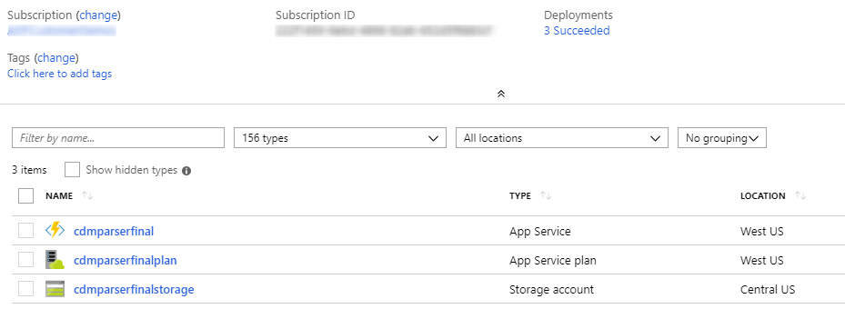 
 
4.	Now you will use Azure CLI to deploy a .zip file to your function app.
    -	[Install Azure CLI](https://docs.microsoft.com/cli/azure/install-azure-cli?view=azure-cli-latest) if you don’t already have it installed.
    -	Or use the [Azure Portal Cloud Shell](https://azure.microsoft.com/features/cloud-shell/).
5.	Follow the [instructions](https://docs.microsoft.com/en-us/azure/azure-functions/deployment-zip-push#cli) to deploy a .zip file and deploy the [zip file from the repository](https://github.com/Azure-Samples/cdm-azure-data-services-integration/tree/master/AzureDataFactory/sample-azure-function)
    a.	If the resource group is not found, be sure to have selected your subscription with:  
    `az account set –subscription /<subscriptionId>`  
    b.	Once deployed, make sure to [get the function URL](https://docs.microsoft.com/azure/azure-functions/functions-create-first-azure-function#test-the-function) as you will need this in the next step.

##### 4.5.1.2	Deploy an Azure Data Factory
1.	Create an [ADF V2 data factory](https://docs.microsoft.com/azure/data-factory/quickstart-create-data-factory-portal#create-a-data-factory)
2.	Deploy your Azure Data Factory entities [through a custom template through the Azure portal](https://docs.microsoft.com/azure/azure-resource-manager/resource-group-template-deploy-portal). The custom template for the data factory and entities can be found in the repository. There are two different ARM templates you can deploy:
    -	**adf-arm-template-databricks-cdm-to-dw/** - deploy this ARM template for the data factory and pipeline that invokes the Databricks data preparation notebook and then copies data from the prepared CDM folder and loads it into the data warehouse
    - **adf-arm-template-cdm-to-dw/** - deploy this ARM template for the data factory and pipeline that copies data from a CDM folder and loads it into the data warehouse.  NOTE: Only use this template if you have decided not to use Databricks to prepare the data. 
3.	 The files you will need within the directories are [arm_template.json](https://github.com/Azure-Samples/cdm-azure-data-services-integration/tree/master/AzureDataFactory/sample-azure-function) and [arm_template_parameters.json](https://github.com/Azure-Samples/cdm-azure-data-services-integration/tree/master/AzureDataFactory/sample-azure-function).     
    While deploying the template in the Azure portal, you will be asked fill in the following values for **arm_template_parameter.json**.

| Parameter | Value to be assigned |
|-----------|----------------------|
|`factoryName` |	The name of your ADFV2 data factory you deployed.|
|`ADLSGen2_accountKey`	| Account key for the Data Lake Storage Gen2 service you created in step 3.4. |
|`AzureStorage_connectionString` |	Reference the storage connection string you created in step 3.3.|
|`AzureSqlDW_connectionString` |	Reference the DW connection string you created in step 4.4.1.|
|`ADLSGen2_properties_typeProperties_url` |	Endpoint for the Data Lake Storage Gen2 with the pattern of `https://<accountname>.dfs.core.windows.net` you created in step 3.4|
|`CDMParserUrl` |	This is the URL of your Azure Function app you created in 4.5.1.|
|`AzureDatabricks_accessToken` |	[Enable tokens](https://docs.azuredatabricks.net/administration-guide/admin-settings/tokens.html)   [Generate a token](https://docs.azuredatabricks.net/api/latest/authentication.html#token-management)|
|`AzureDatabricks_domain` |	In format of `https://<domain name>.azuredatabricks.net`|

##### 4.5.1.3	Deploy and configure the pipeline that copies the CDM folder to SQL Data Warehouse 
1.	Open the Azure Data Factory in the Azure Portal. Click on **Author & Monitor**.
    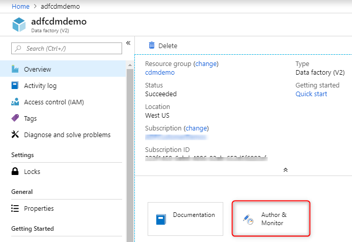    

2.	Once in the ADF UX experience, click on the **Authoring** icon
    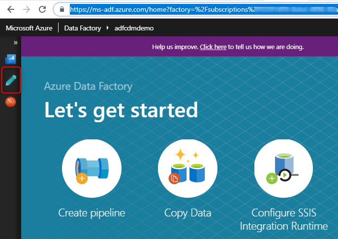    
 
3.	Now, you will be taken to the ADF authoring canvas and see that three pipelines have been deployed under your data factory. You should be concerned with the two top-level pipelines.
    - **MountCDM** – reads the loads the data from ADLSGen2 account in CDM folder, creates staging tables in DW, and loads the data  
        i.	**ProcessEntityData** – this child pipeline is invoked if user chooses to load the data into the target DW  
        ii.	**ProcessEntitySchema** – this child pipeline is invoked if user chooses to create the schema in the DW, which creates a table for each entity in the CDM folder.      

##### 4.5.1.4	MountCDM Pipeline

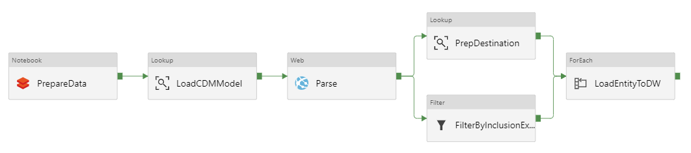
 
The MountCDM pipeline invokes your Databricks notebook, ingests your data from the CDM folder, creates the target schema in the DW, and lands the data.  When running the pipeline, you will see that there are parameters to the pipeline with default values being passed. You can adjust these values depending on your scenario:

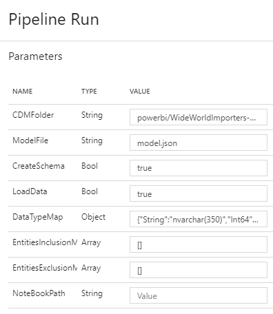

|Parameter Name | Description | Default Value |
|-----------|------------------|----------------------|
|SourceCdmFolder | Location of the source CDM folder |	https://\<adlsgen2accountname>.dfs.core.windows.net/powerbi/\<workspacename>/WideWorldImporters-Sales/model.json |
| PreparedCdmFolder | Location of the output CDM folder in ADLS Gen2 | https://\<adlsgen2accountname>.dfs.core.windows.net/powerbi/\<workspacename>/WideWorldImporters-Sales-Prep   Note: use a different location than the one used in the notebook itself.|
|CDMFolder | File path of the CDM data in the ADLS Gen 2 account | 	powerbi/\<workspacename>/WideWorldImporters-Sales-Prep. This should the same latter file path as your “PreparedCdm” folder from Databricks. |
| ModelFile | Name of the model file | model.json |
|CreateSchema | Create the table schema on the destination for each included CDM Entity. | true   Mark as false if the target schema has already been created or this will throw an error.	| true |
| LoadData | Load data into the destination. (Mark as false if you don’t want the pipeline to load data into the DW) | true |
| DataTypeMap	| Object that contains a list of datatype mappings between CDM and SQL datatypes.  Adjust for your data.	| {        "String":"nvarchar(350)",   "Int64":"int",   "DateTime":"datetime",   "Boolean":"bit",   "Double":"float",   "Decimal":"float",   "DateTimeOffset":"DateTimeOffset"   } |
|EntitiesInclusionMap | Array of CDM entities you want to copy. If empty, pipeline will load all entities. | [] |
| EntitiesExclusionMap | Array of CDM entities you want to exclude from copy. If empty, pipeline will load all entities. | [] | 

Once the ADF pipeline has completed, inspect the data warehouse using SSMS.  You should see the eight staging tables, each of which is populated with data. 

### 4.6	Deploy the dimensional schema to the DW and transform the staged data

In this section you deploy the dimensional schema to the data warehouse, which includes stored procedures that transform data from the staging tables to dimension and fact tables in a [star schema](https://wikipedia.org/wiki/Star_schema).   

#### 4.6.1	Deploy the dimensional schema
When the deployment of the data warehouse has finished, deploy the SQL schema provided in the WWI-Sales.sql file in the …\AzureSqlDatawarehouse\ folder in the downloaded repo.   
1.	Using SSMS or Azure Data Studio, connect to the SQL Data Warehouse 
1.	Open the WWI-Sales SQL file and execute the SQL to deploy the schema. 
The schema adds the following tables, plus transform procedures and intermediate tables and views:  
    -	**Order** fact table, from SalesOrderHeaders, SalesOrderLines,
    -	**Customer** dimension, from SalesCustomers, SalesBuyingGroups, SalesCustomerCategories
    -	**StockItem**, from WarehouseStockItems, WarehouseColors, WarehousePackageTypes 
    -	**CalendarDate**, a prepopulated standard calendar date dimension.

The data warehouse is populated using an ‘ELT’ approach.  **E**xtracted (and prepared) data is **L**oaded into staging tables and then **T**ransformed using stored procedures to a dimensional model.  The ELT approach leverages the power of the SQL Data Warehouse MPP architecture to apply set-based transforms in the data warehouse.  

Review the SQL file to see the patterns used.

#### 4.6.2	Execute the transform procedures to populate the dimensional model
Execute the transform procedures to populate the dimension and fact tables.  
1.	In SSMS, run the following statement: `EXEC spTransformWideWorldImporters -Orders`

This procedure invokes transform procedures for each dimension table and then the fact table.  Review the SQL for each procedure to see the patterns used. 

>NOTE: The execution of the stored procedure can be added to the pipeline in ADF so that it occurs immediately after the staging data is loaded. 

At this point you have transformed the data in the staging tables and can now explore the dimensional model in the data warehouse.  The data in the data warehouse is consistent with the data extracted from the original Wide World Importers database using Power BI dataflows and prepared by Databricks.  

## 5	Conclusion
Congratulations if you made it to the end. The tutorial is intended to give you a first look at how to use CDM folders to share data between Power BI and Azure Data Services.  The samples provided with this tutorial are intended only to let you explore the scenario and should not be used in production applications. Please use the "issues" feature in this GitHub repo to share feedback, questions or issues.

## 6	Additional Resources
To learn more about Power BI dataflows, CDM, and Azure Data Services, follow the links below:

•	[Power BI Dataflows](https://powerbi.microsoft.com/blog/introducing-power-bi-data-prep-wtih-dataflows/)  
•	[Common Data Model](https://aka.ms/cdmoverview)  
•	[CDM in ADLSg2 & CDM folders](https://docs.microsoft.com/common-data-model/data-lake)   
•	[Azure Data Factory](https://azure.microsoft.com/services/data-factory/)  
•	[Azure Databricks](https://azure.microsoft.com/services/databricks/)  
•	[Azure SQL Data Warehouse](https://azure.microsoft.com/services/sql-data-warehouse/)  
•	[Azure Machine Learning](https://azure.microsoft.com/services/machine-learning-studio/)  
•	[Azure Data Lake Storage Gen 2](https://azure.microsoft.com/services/storage/data-lake-storage/)  
